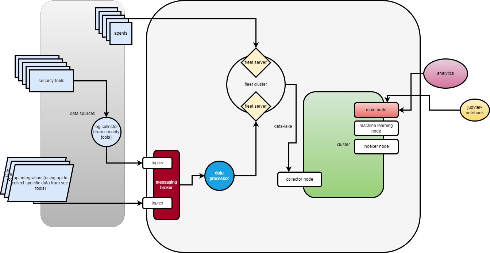

# Cybersecurity Data Collection and Processing System: Using A Fleet style to manage collection & Storage 

## Table of Contents
1. [Executive Summary](#executive-summary)
2. [Introduction](#introduction)
3. [System Overview](#system-overview)
4. [Components](#components)
5. [Data Flow](#data-flow)
6. [Interconnection of Components](#interconnection-of-components)
7. [Conclusion](#conclusion)
8. [Contact Information](#contact-information)

## Executive Summary

This document outlines the design, development, and implementation of a cybersecurity data collection and processing system. The system aggregates, processes, and analyzes security data from various sources to provide actionable insights and enhance the organization’s security posture. This comprehensive guide details the components, data flow, interconnection, and processes involved in creating a robust and scalable cybersecurity infrastructure.

## Introduction

As cyber threats continue to evolve, organizations must adopt sophisticated systems to monitor, detect, and respond to security incidents. This document presents a detailed overview of a cybersecurity data collection and processing system designed to meet these needs. The system integrates various security tools, data processors, and analytics platforms to ensure comprehensive security coverage.

## System Overview

The cybersecurity data collection and processing system is designed to handle large volumes of security data from diverse sources. It consists of multiple components, including security tools, agents, log collectors, data processors, and analytics platforms. The system’s architecture ensures seamless data flow, real-time processing, and actionable insights.

## High Level Diagram

## Components

### Detailed Notes for Each Component

| **Component**            | **Purpose**                                                                 | **Examples**                                                           | **Details**                                                                                                                                                                                                                                        |
|--------------------------|-----------------------------------------------------------------------------|-----------------------------------------------------------------------|----------------------------------------------------------------------------------------------------------------------------------------------------------------------------------------------------------------------------------------------------|
| **Security Tools**       | Generate logs and alerts based on security events.                          | Firewalls, IDS/IPS, Antivirus software, EDR systems.                  | These tools continuously monitor the network, endpoints, and other resources within an organization. They generate valuable security data that is essential for identifying and responding to potential threats.                                 |
| **Agents**               | Collect logs and data from security tools and send them to the log collector.| Lightweight programs installed on endpoints and servers.              | Agents are crucial for real-time data collection. They ensure that all relevant security data is captured and transmitted to the log collector for aggregation. Agents must be efficiently managed to minimize their impact on system performance. |
| **Log Collector**        | Aggregates logs from various security tools.                                | Centralized log management systems.                                   | The log collector serves as a central repository for all collected logs and security data. It consolidates data from multiple sources, making it easier to process and analyze. It is essential to ensure that the log collector can handle the volume of data generated by the organization's security tools. |
| **API Integrations**     | Collects specific data from security tools using APIs.                      | RESTful APIs provided by security tools.                              | API integrations are used for tools that do not support agents. They allow for the collection of specific data points directly from the security tools. Proper management and security of API integrations are crucial to prevent unauthorized access. |
| **Messaging Broker**     | Manages communication between system components.                            | Apache Kafka, RabbitMQ.                                               | The messaging broker organizes the aggregated data into topics and ensures reliable data transmission between different components. It plays a critical role in maintaining the efficiency and reliability of the data flow within the system.     |
| **Data Processor**       | Processes raw data.                                                         | Data processing pipelines.                                            | The data processor filters, normalizes, and enriches the raw data received from the messaging broker. This step is vital for transforming raw data into a consistent format and adding contextual information that is essential for analysis.       |
| **Fleet Server and Cluster** | Manages agents and collects data.                                       | Fleet management systems.                                             | The fleet server oversees the agents and ensures high availability and scalability by distributing the data collection load across multiple servers. The cluster provides additional processing power and redundancy.                             |
| **Data Lake**            | Long-term storage of processed data.                                        | Amazon S3, Hadoop Distributed File System (HDFS).                     | The data lake stores large volumes of processed data, enabling extensive historical analysis and retrieval. It is designed to handle diverse data types and formats, ensuring that data is easily accessible for analysis.                         |
| **Collector Node**       | Prepares data for analysis.                                                 | Indexing and structuring tools.                                       | The collector node indexes and structures the data stored in the data lake. This step is crucial for making the data searchable and easily retrievable for further analysis. Efficient indexing improves the performance of query operations.        |
| **Cluster**              | Performs computational tasks.                                               | Distributed computing clusters.                                       | The cluster includes multiple nodes that perform various computational tasks. The main node coordinates the activities, the machine learning node conducts advanced analytics, and the indexer node ensures the data remains searchable. This setup allows for scalable and efficient processing of large datasets. |
| **Analytics**            | Analyzes processed data.                                                    | SIEM systems, Business Intelligence (BI) tools.                       | The analytics component generates dashboards, reports, and alerts based on the processed data. It provides actionable insights that help security analysts monitor the system and identify potential threats. Customizable dashboards and real-time alerting are key features. |
| **Jupyter Notebook**     | Interactive data exploration.                                               | JupyterLab, Google Colab.                                             | Jupyter Notebook provides an interactive environment for data scientists and analysts to explore and analyze the data. It supports ad-hoc analysis, visualization, and prototyping, enabling analysts to delve deeper into the data and develop custom analytics solutions. |

## Data Flow

The data flow within this cybersecurity data collection and processing system involves multiple stages, each crucial for transforming raw security data into actionable insights. Below is a detailed description of each step in the data flow:

1. **Data Generation (Security Tools)**: Security tools generate logs and alerts based on security events.
2. **Data Collection (Agents and API Integrations)**: Agents and API integrations capture and send data to the log collector.
3. **Aggregation (Log Collector)**: The log collector aggregates data from multiple sources.
4. **Transmission (Messaging Broker)**: The messaging broker organizes and transmits the aggregated data.
5. **Data Processing (Data Processor)**: The data processor filters, normalizes, and enriches the data.
6. **Storage (Fleet Server and Data Lake)**: Processed data is stored in the data lake.
7. **Indexing (Collector Node)**: The collector node indexes the data for easy retrieval.
8. **Analysis (Cluster and Analytics)**: The cluster performs computational tasks, and analytics generate insights.
9. **Interactive Exploration (Jupyter Notebook)**: Data scientists use Jupyter Notebook for deeper analysis.

## Interconnection of Components

The components of this cybersecurity data collection and processing system are interconnected to ensure seamless data flow and efficient processing. Here is a detailed description of how each component interacts with others:

1. **Security Tools to Agents and API Integrations**: Security tools generate logs, which are captured by agents or collected via API integrations.
2. **Agents and API Integrations to Log Collector**: Data is sent to the log collector for aggregation.
3. **Log Collector to Messaging Broker**: Aggregated data is forwarded to the messaging broker.
4. **Messaging Broker to Data Processor**: The data processor processes the raw data.
5. **Data Processor to Fleet Server and Data Lake**: Processed data is sent to the fleet server and stored in the data lake.
6. **Data Lake to Collector Node**: The collector node indexes the stored data.
7. **Collector Node to Cluster**: Indexed data is made available to the cluster for computational tasks.
8. **Cluster to Analytics**: Results from the cluster are used by the analytics component.
9. **Cluster and Analytics to Jupyter Notebook**: Data scientists use Jupyter Notebook for interactive exploration.

